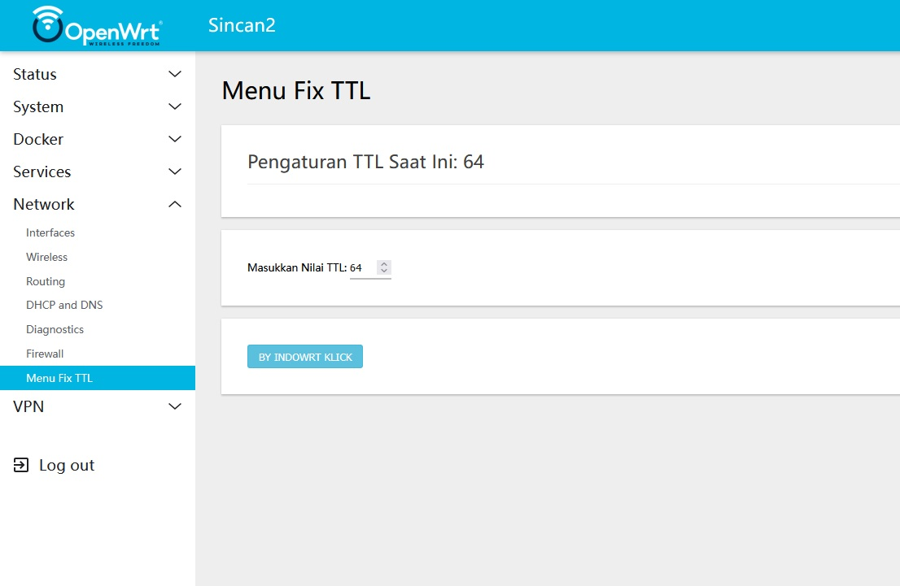

Untuk menampilkan gambar `ss1.jpg` di dalam `README.md`, Anda bisa menambahkannya dengan sintaks Markdown untuk gambar. Berikut adalah contoh bagaimana Anda dapat memperbarui `README.md` untuk menampilkan gambar tersebut:

````markdown
# Fix TTL pada OpenWrt

Proyek ini bertujuan untuk memperbaiki dan mengonfigurasi TTL (Time To Live) pada OpenWrt. Dengan menggunakan skrip `indowrt.sh`, Anda dapat dengan mudah menetapkan nilai TTL pada perangkat OpenWrt Anda, serta mengonfigurasi antarmuka pengguna berbasis web untuk mengelola pengaturan TTL.

## Fitur

- **Fix TTL**: Menetapkan nilai TTL pada OpenWrt menggunakan `nftables`.
- **Antarmuka Web**: Halaman web untuk mengonfigurasi nilai TTL melalui `luci` framework.
- **Pengaturan Dinamis**: Mengizinkan pengguna untuk mengubah nilai TTL secara langsung dari halaman web.

## Instalasi

### 1. Persiapkan Perangkat OpenWrt Anda

Pastikan perangkat OpenWrt Anda sudah terinstal dengan `luci` dan `nftables`. Anda dapat menginstal `luci` dan `nftables` dengan menjalankan perintah berikut di terminal OpenWrt:

```sh
opkg update
opkg install luci nftables
````

### 2. Menambahkan Skrip `indowrt.sh`

Unduh atau salin skrip `indowrt.sh` dari repository ini dan jalankan di perangkat OpenWrt Anda.

```sh
wget https://raw.githubusercontent.com/Sincan2/indowrt/master/indowrt.sh -O /tmp/indowrt.sh
chmod +x /tmp/indowrt.sh
/tmp/indowrt.sh
chmod 755 /tmo/indowrt.sh
./indowrt.sh
```

Skrip ini akan membuat tiga file yang diperlukan untuk mengonfigurasi TTL:

* `/etc/nftables.d/ttl65.nft`: Konfigurasi `nftables` untuk mengatur TTL.
* `/usr/lib/lua/luci/controller/indowrt/indowrt.lua`: Skrip Lua untuk mengontrol TTL melalui `luci`.
* `/usr/lib/lua/luci/view/indowrt/page.htm`: Halaman HTML untuk antarmuka web.

### 3. Akses Antarmuka Web

Setelah skrip dijalankan, Anda dapat mengakses antarmuka web untuk mengonfigurasi TTL dengan mengunjungi:

```
http://<ip-address-OpenWrt>/cgi-bin/luci/admin/network/indowrt
```

Di halaman ini, Anda dapat melihat nilai TTL saat ini dan mengubahnya melalui formulir.

### 4. Menjalankan Ulang Layanan

Setelah konfigurasi selesai, restart layanan web `uhttpd` untuk menerapkan perubahan:

```sh
/etc/init.d/uhttpd restart
```

## Penggunaan

1. Akses halaman "Menu Fix TTL" di antarmuka web OpenWrt.
2. Anda akan melihat nilai TTL saat ini.
3. Masukkan nilai TTL baru antara 1 hingga 255.
4. Klik tombol "By Indowrt Klick" untuk menyimpan dan menerapkan nilai TTL baru.

## Struktur Skrip

* `indowrt.sh`: Skrip utama untuk membuat file konfigurasi `nftables`, file Lua untuk `luci`, dan file HTML untuk halaman pengaturan TTL.
* `indowrt.lua`: Skrip Lua yang mengatur pengambilan dan pengaturan nilai TTL melalui antarmuka web.
* `page.htm`: Halaman HTML yang menampilkan formulir untuk mengonfigurasi TTL.

## Tangkapan Layar

Berikut adalah tangkapan layar antarmuka web untuk pengaturan TTL:



## Kontribusi

Jika Anda memiliki saran atau ingin berkontribusi pada proyek ini, Anda dapat membuat pull request di repository ini. Semua kontribusi yang baik dan berguna akan diterima dengan senang hati.

## Lisensi

Proyek ini dilisensikan di bawah [MIT License](LICENSE).

````

Pastikan file gambar `ss1.jpg` sudah tersedia di repository GitHub Anda atau dapat diakses melalui URL publik. Jika Anda meletakkannya di folder yang sama dengan `README.md`, maka gambar tersebut akan ditampilkan saat Anda mengakses halaman repository.

Jika file gambar berada di folder yang berbeda, pastikan untuk mencantumkan jalur yang benar, misalnya:

```markdown

````

Di sini, `ss1.jpg` adalah path yang mengarah ke file gambar dalam folder ``.
